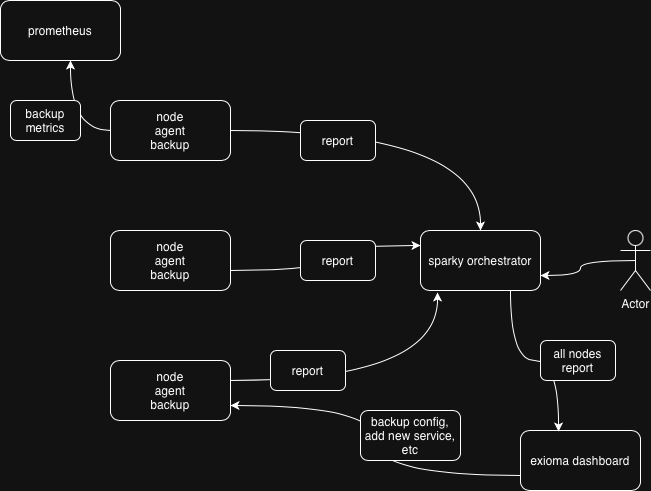

# sparky-for-backup

# HLD

Архитектурная схема

- на всех нодах развернуты sparky агенты которые с переодичностью настраивают и выпонлняют бэкапы
- агенты также гарантируют изначальную настройку borg репозиториев
- у сервиса требующего бэкап может быть кастомная логика создания бэкапа ( например для сервиса Postgresql сначал бэкап создаетс через pg_dump и потом направляется в borg репозиторий )
- агенты отправляют данные ( в различном формате ) о бэкапах в sparky оркестратор ( по https протоколу ), орекстратор обрабатывает полученные данные с нод и агрегирует их ввиде различных отчетов, данные также могут перенаправлятся в web консоль exioma для последующего просмотра пользователем, также отчеты можно напрямую смотреть через UI орекстратора
- при необходимости бэкапа могут быть запущеные в ручном режиме ( например в случае разовых сбоев ) , для это используется sparky окрестартор к которым агенты взаимодейтсвуют в  режиме pull через http очередь
- конфигурации бэкпов и добавление новых сервсисов в бэкапы происходит запуском ansible плейбуков (бандлов?) через web консоль exioma, в качестве альтернативе можно рассмотреть стягивания обновленных конфигурации на агентах через git (sparky агенты поддерживают это из коробки)
- при необходимости можно запускать распаковку (extract) бэкапов из borg репозиториве посредством запусках тех же ансибл бандлов или через интерфейс Sparky орекстратора

- ssh ключи для доступа к borh репозитариям добавляются через механизм ansible бандлов запущенных на нода с репозиториями, альтернативно можно делать туже самую операцию через Sparky окрестратор - что может быть удобно - когда ключи ротейтся на агенты и агенты отправляют свои обновленные public ключив  окркестатор и орекестратор обнолвняет их на нодах с репозитарями - в это случае мы минимизируем сетевой трафик ( по сравнению со схемой через ансибл ) и делае решение более секьрным ( private части ключей не гоняются по сети )
  

Security и сетевая схема

В данной схеме ноды со sparky агентами недоступы из вне, все взаимодейтсвтие в оркестарторм проихсохит в pull режиме по https, с  аутентефикацией ( SPARKY_API_TOKEN) -  то есть эта схема более безопасная по сравней с тем когда мы обновляется конифигцарции и запускаем бэкапы через ансибл по ssh в push режиме. Также она более масштабируемая (с ростом кол-ва нод) - так как все операции происходят не в одном узком месте ( ansible contole plane) - а в распределленом режиме на нодах, независимости и статусы отсылаются в орекстратор, 
если нужен ревесивный флоу когда команды шлюься от оркестртора (например при manual backup-ах) то это с точки зрения транспорта это так же обеспечиваются через pull модель - когда агенты постоянно опрашивают очередь оркестратора ( раз в несколько минут ) и получают новые команды
